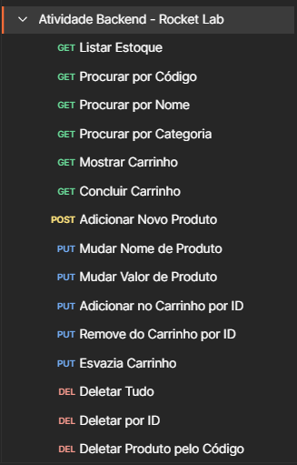

Atividade concluída com sucesso

todos os comandos acima testados e funcionando com sucesso

É necessário para a execução bem sucedida ter instalado no seu computador:
* NestJS
* NodeJS
* Postman (para testar as requisições)
* Prisma
* Typescript
* pnpm (de preferência)

# Após clonar o repositório

1. pnpm install

2. pnpm run start

3. pnpm run start:dev

4. Entrar no postman usando o [link](https://www.postman.com/felipedurant/workspace/felipe-durant-rocket-lab/overview)

5. Executar comandos enquanto o backend está sendo executado através do "pnpm run start:dev"